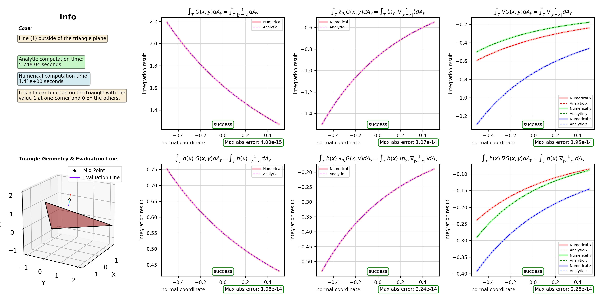

# Exact 3D Greens Function Integrations on Triangles


*This demo computes exact integrations of 3D Green's functions and compares them with numerical solutions.*

We compute analytically the Green's and its gradient and product with linear functions on a triangle T in R3.

Let x be an evaluation point, r(x,y) = |y-x| and Let h(x) be a linear function on the triangle with value 1 at the first triangle vertex and 0 on the other vertices.

We compute the following integrals 

$\int_T \ G(x,y) dA_y = \int_T \ \frac{1}{|y-x|} dA_y$

$\int_T \ h(x) \ G(x,y) dA_y = \int_T \ h(x) \ \frac{1}{|y-x|} dA_y$

$\int_T \ \partial_{n_y} G(x,y) dA_y = \int_T \ \langle n_y , \nabla \frac{1}{|y-x|} \rangle dA_y$

$\int_T \ h(x) \ \partial_{n_y} G(x,y) dA_y = \int_T \ h(x) \ \langle n_y , \nabla \frac{1}{|y-x|} \rangle dA_y$

$\int_T \ \nabla G(x,y) dA_y = \int_T \ \nabla \frac{1}{|y-x|} dA_y$

$\int_T \ h(x) \ \nabla G(x,y) dA_y = \int_T \ h(x) \ \nabla \frac{1}{|y-x|} dA_y$

An abitrary triangle is generated by the vertices V[0], V[1], V[2].
A wide selection of test evaluation points are generated.
The analytic computation is performed based on [Graglia]'s results.
The a numerical integration is performed via scipy.integrate.dblquad.

The test evaluation points are lines going through:
- a point further outside of the triangle plane
- a point in the triangle plane but not in the triangle or along an extended edge
- a point on the extended edge of a triangle
- a point on the extended edge of a triangle but off the other direction
- a point in the triangle but not on an edge
- a point on an edge but not a vertex
- a triangle vertex (the first one, where h=1) 

The following reference was the base for the formulae in this code:
[Graglia] R. D. Graglia, "Numerical Integration of the Linear Shape Functions Times the 3-D Green's Function
or Its Gradient on a Plane Triangle," IEEE Transactions on Antennas and Propagation, 
vol. 41, no. 10, pp. 1448–1455, Oct. 1993.

The formulas have been adjusted to not require a transformation into the local triangle frame.
Additionally, an orientation dependant singularity issue on the extended edge of a triangle has been fixed.

Important note: When an evaluation point is at the boundary of the triangle, the tangential part of the gradient integrals become singular.

Running the code will show you the following results:


*Figure 1: Integration results for a line through a point outside of the triangle plane.*


*Figure 2: Integration results for a line through a point in the triangle plane but not in the triangle or along an extended edge.*


*Figure 3: Integration results for a line through a point on the extended edge of a triangle.*


*Figure 4: Integration results for a line through a point on the extended edge of a triangle but off the other direction. [Graglia]'s formulae would fail in this case.*


*Figure 5: Integration results for a line through a point in the triangle but not on an edge.*


*Figure 6: Integration results for a line through a point on an edge but not a vertex. There is a singularity.*


*Figure 7: Integration results for a line through a triangle vertex (the first one, where h=1). There is a singularity.*

## License

This project is licensed under the MIT License. See the [LICENSE](https://github.com/marcelpadilla/exact-3D-greens-function-integrations-on-triangles/blob/main/LICENSE) file for details.

## Citation

If you use this code in your research, please cite it as follows:

```bibtex
@misc{padilla2025exact3Dgreens,
    author = {Marcel Padilla},
    title = {Exact 3D Greens Function Integrations on Triangles},
    year = {2025},
    publisher = {GitHub},
    journal = {GitHub repository},
    howpublished = {\url{https://github.com/marcelpadilla/exact-3D-greens-function-integrations-on-triangles}},
}
```

<button onclick="navigator.clipboard.writeText('@misc{padilla2025exact3Dgreens,\n    author = {Marcel Padilla},\n    title = {Exact 3D Greens Function Integrations on Triangles},\n    year = {2025},\n    publisher = {GitHub},\n    journal = {GitHub repository},\n    howpublished = {\\url{https://github.com/marcelpadilla/exact-3D-greens-function-integrations-on-triangles}},\n}')">Copy Citation</button>